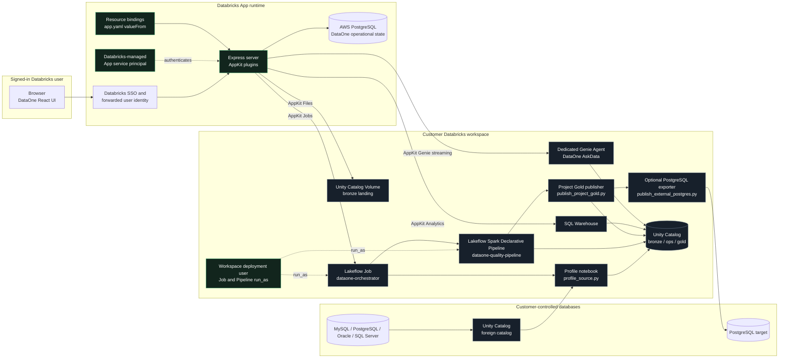

# Veltirs DataOne architecture and Databricks integration guide

This document describes the implementation in this repository, the end-to-end user journeys, and the work required to turn the current workspace deployment into a portable Databricks Marketplace app.

## 1. What is implemented today

Veltirs DataOne is a React/TypeScript Databricks App with an Express/AppKit backend. It accepts one of two governed source types:

1. A CSV, JSON, Parquet, or SQLite file uploaded to a Unity Catalog Volume.
2. A three-part Unity Catalog table name (`catalog.schema.table`) that the Job's workspace deployment-user identity is already allowed to read.

The application then triggers a Lakeflow Job. The first Job task profiles and reshapes the source into governed Delta tables. The second task starts a serverless Lakeflow Spark Declarative Pipeline that cleans the data and materializes quality, mapping, preview, and business summary tables. A third task publishes passed records to a managed Delta table whose safe snake-case name is derived from the UI project name. A fourth, optional task publishes business columns to PostgreSQL over JDBC. The UI reads governed outputs through a SQL warehouse and offers natural-language questions through a dedicated Genie Agent.

The platform resources are now deployed in workspace `1354394467602787`. Run `66144670168681` verified the target Job and Pipeline with a CSV source: 16 rows were checked, 10 passed rows were published to `workspace.dataone_gold.current_workspace_migration_demo`, and 6 were quarantined. App deployment is pending the AWS connection objects and secret values that cannot be exported from the previous workspace.

Production database onboarding now uses install-time Unity Catalog connection bindings and foreign catalogs. React receives table metadata, connection aliases, and object names only; it never receives a source or target password. AWS PostgreSQL replaces SQLite for operational state and stores aliases, project definitions, and Databricks run references. The local demo remains deliberately separate and can still use loopback-only credentials for local MySQL/PostgreSQL verification.

## 2. Runtime architecture



There are three separate identities in this diagram:

- **Human identity:** Databricks authenticates the person opening the hosted app. `server/server.ts` exposes `/api/whoami`, which reads the Databricks-provided `x-forwarded-user` and `x-forwarded-email` headers so the UI can display who is signed in. The route rejects a production request that has no forwarded user ID.
- **AppKit execution identity:** Files, Analytics, Jobs API calls, and Genie use the Databricks-managed App service principal created in the installation workspace and its bound resource grants. See `[DBX-SERVICE-PRINCIPAL]` in `databricks.yml`. A browser never receives this principal's credentials.
- **Lakeflow workload identity:** The Job and Pipeline explicitly set `run_as.user_name: ${workspace.current_user.userName}` and therefore execute as the workspace user who deployed the bundle. See `[DBX-JOB-RUN-AS]` and `[DBX-PIPELINE-RUN-AS]` in `resources/`. The app principal can start and monitor the bound Job through `CAN_MANAGE_RUN`; it does not become the Spark Job/Pipeline identity.

Displaying the signed-in person is not, by itself, row-level authorization. App users share the app principal's AppKit permissions and trigger workloads under the configured deployment-user identity unless the application adds a user-authorization design on top.

## 3. Resource bindings and environment mapping

The application is deployed as a Declarative Automation Bundle. Resource declarations live in `databricks.yml`; runtime environment mappings live in `app.yaml`.

| Binding key                   | Declared resource and permission     | Runtime environment variable   | Used by                                                 |
| ----------------------------- | ------------------------------------ | ------------------------------ | ------------------------------------------------------- |
| `sql-warehouse`               | SQL warehouse, `CAN_USE`             | `DATABRICKS_WAREHOUSE_ID`      | AppKit `analytics()` and `useAnalyticsQuery(...)`       |
| `files`                       | Unity Catalog Volume, `WRITE_VOLUME` | `DATABRICKS_VOLUME_FILES`      | AppKit `files(...)`, `/api/files/files/*`               |
| `job`                         | Lakeflow Job, `CAN_MANAGE_RUN`       | `DATABRICKS_JOB_ID`            | AppKit `jobs(...)`, `/api/jobs/default/*`               |
| `genie-space`                 | Genie Agent, `CAN_RUN`               | `DATABRICKS_GENIE_SPACE_ID`    | AppKit `genie(...)`, `/api/askdata/default/messages`    |
| `source-connection`           | UC connection, `USE_CONNECTION`      | `DATABRICKS_SOURCE_CONNECTION` | Federated source alias and persisted connection profile |
| `target-connection`           | UC connection, `USE_CONNECTION`      | `DATABRICKS_TARGET_CONNECTION` | External target alias; writes still use the Job task    |
| `state-db-url`                | Databricks secret, `READ`            | `DATAONE_DATABASE_URL`         | AWS PostgreSQL operational store                        |
| `churn-table`                 | UC table, `SELECT`                   | Not mapped to an app variable  | App resource boundary; Job read uses deployer grants    |
| DataOne result-table bindings | Individual UC tables, `SELECT`       | Not mapped to app variables    | SQL text in `config/queries/*.sql`                      |

`app.yaml` uses `valueFrom`, so resource IDs and paths are resolved from the app resource keys at deployment instead of being placed in browser code. Databricks documents this model in [Add resources to a Databricks app](https://docs.databricks.com/aws/en/dev-tools/databricks-apps/resources) and [Define environment variables in a Databricks app](https://docs.databricks.com/aws/en/dev-tools/databricks-apps/environment-variables).

The `current` target in `databricks.yml` contains the target workspace host, warehouse ID, and governed Volume name. The Job, Pipeline, schemas, volume, secret scopes, and Genie Agent are provisioned by the bundle. AWS connection names and secret values remain installation-specific and must be supplied by an administrator; Marketplace packaging must expose those as installer-selected or installer-provisioned resources.

### Why AppKit is used instead of browser-side SDK calls

`server/server.ts` initializes these AppKit plugins:

- `analytics()` for named SQL queries.
- `files(...)` for governed Volume operations with a server-side policy.
- `jobs(...)` for starting and monitoring the bound Job with a strict Zod parameter schema.
- `genie(...)` for the dedicated `default` Genie Agent alias.
- `server()` for custom Express routes.

The React UI calls same-origin AppKit endpoints and hooks. There are no direct Databricks `/api/2.0/...` calls and no direct `WorkspaceClient` use in application code. Although `@databricks/sdk-experimental` is a dependency, this implementation does not import it. AppKit supplies the backend API surface and handles the bound resource context.

Use a direct Databricks SDK or REST API only for a capability that AppKit does not provide. Such a call still belongs on the server, should use the app service principal, should read resource identifiers from bindings, and should apply input validation and an explicit authorization policy. A personal access token is not a Marketplace runtime mechanism.

## 4. End-to-end user journeys

### Journey A: file upload

1. The user signs in to Databricks and opens DataOne.
2. The UI calls `/api/whoami` and displays the signed-in Databricks identity.
3. The user enters a project name and selects a CSV, JSON, Parquet, or SQLite file. SQLite is inspected locally so the user can select a table, then the database snapshot is uploaded to the governed Volume.
4. `DataOneApp.tsx` validates the extension and size, generates a run ID, and builds a path under `<format>/<project>/<run-id>/`.
5. The UI calls `POST /api/files/files/mkdir`, then `POST /api/files/files/upload?path=...`.
6. AppKit Files resolves the `files` Volume binding. `server/dataoneValidation.ts` rejects deletion, path traversal, mismatched format folders, unsupported paths, oversized files, and production upload requests without a human user context.
7. The browser sends validated Job parameters to `POST /api/jobs/default/run`.
8. AppKit Jobs resolves the bound `dataone-orchestrator` Job and returns a Databricks run ID.
9. The UI polls `GET /api/jobs/default/runs/<run-id>` every three seconds, backs off to six seconds after a polling error, and moves to results only when the run succeeds.

### Journey B: existing Unity Catalog table

1. The user selects **Unity Catalog table** and enters `catalog.schema.table`.
2. Both client and server validate the three-part name. The profiling notebook repeats the validation before calling `spark.table(...)`.
3. No file is uploaded. The same Job is started with `source_mode=uc_table` and the selected table name.
4. Unity Catalog enforces whether the Job's workspace deployment-user `run_as` identity can read the table. A syntactically valid name does not grant access.
5. Job execution, Pipeline execution, result queries, and Genie follow the same path as Journey A.

### Journey C: inspect an older run

1. The setup page runs the named `recent_runs` Analytics query.
2. Selecting a completed run reconstructs the UI run context from the operations ledger.
3. The results page passes that `run_id` to every run-scoped named query.
4. The data remains in Unity Catalog; the browser receives only query results needed by the current view.

### Journey D: AskData / natural language to SQL

1. The user enters a question in the AppKit `GenieChatInput`.
2. `useGenieChat(...)` posts to `/api/askdata/default/messages`.
3. The custom Express route validates a non-empty question of at most 4,000 characters.
4. `appkit.genie.sendMessage(...)` sends the question and optional conversation ID to the bound Genie Agent.
5. Server-Sent Events stream progress, the answer, generated SQL, and query results back to the AppKit chat components.
6. The UI shows streaming and error states, the conversation ID, zero-row guidance, the generated SQL/results supplied by AppKit, and an AI-result warning.

The Genie configuration in `config/genie/dataone-space.json` defines the curated tables, descriptions, sample questions, SQL examples, joins, and benchmark questions. The current Genie boundary is intentionally narrower than the whole catalog.

### Journey E: federated source and external PostgreSQL target

1. During installation, an administrator creates the Unity Catalog connection and foreign catalog, then supplies the connection name as a bundle variable.
2. `app.yaml` resolves the connection resource with `valueFrom`; React never receives its credentials.
3. `source_table_inventory.sql` queries `system.information_schema` so the setup page shows only tables visible to the app service principal.
4. Selecting a table stores its three-part name and project definition in AWS PostgreSQL, then starts the bound orchestrator Job.
5. `profile_source.py` reads the managed or foreign table with `spark.table(...)`; the same Lakeflow Pipeline performs quality and transformation.
6. `publish_project_gold.py` writes the governed project table to Unity Catalog.
7. If `external_target_enabled=true`, `publish_external_postgres.py` reads fixed JDBC settings from a Databricks secret scope, removes `_dataone_*` metadata columns, writes the transformed business columns, and verifies the row count.

## 5. Job and Pipeline execution

### Orchestrator Job

`resources/dataone_orchestrator.job.yml` defines `dataone-orchestrator` with a single-concurrency queue and four ordered tasks:

1. `profile_source` runs `src/jobs/profile_source.py` with the project, run, source mode, source location, format, JSON mode, and table parameters.
2. `quality_pipeline` waits for `profile_source`, then starts the bound `dataone-quality-pipeline` without a full refresh.
3. `publish_project_gold` waits for `quality_pipeline`, validates that `output_table` is the deterministic name derived from `project_name`, and overwrites that project's managed Delta table with the newest non-quarantined records.
4. `publish_external_postgres` waits for Gold publication. It exits cleanly when disabled; when enabled it publishes and verifies only business columns in the configured PostgreSQL target.

The app service principal has `CAN_MANAGE_RUN` so AppKit can start and monitor this bound Job; the Job itself executes as the workspace deployment user through `run_as.user_name: ${workspace.current_user.userName}`. The workspace `users` group has `CAN_VIEW`, and all tasks have explicit timeouts.

### Project Gold publisher

`src/jobs/publish_project_gold.py` reads the Pipeline's run-scoped `cleaned_records` view and the profile task's schema contract. It excludes quarantined records, expands cleaned JSON into normalized project columns, appends `_dataone_*` audit columns, and writes a managed Delta table in `workspace.dataone_gold`. Browser-supplied SQL is never executed: the client, AppKit backend, and notebook independently derive or validate the table name before the quoted identifier is used. Re-running the same project intentionally replaces that project's final table and schema.

### Profiling notebook

`src/jobs/profile_source.py`:

- Validates parameters again inside Databricks compute.
- Reads the selected Volume file with Spark or reads a UC table with `spark.table`.
- Rejects an empty source, duplicate column names, more than 200 columns, and unsupported/unsafe paths.
- Profiles at most 250,000 rows.
- Computes source types, missing counts, approximate distinct counts, normalized target names, and deterministic mapping confidence.
- Appends schema profiles to `workspace.dataone_ops.schema_profiles`.
- Converts arbitrary source rows to a generic cell representation and appends them to `workspace.dataone_bronze.ingested_cells`.
- Appends a run record to `workspace.dataone_ops.project_runs`.

The mapping proposal is a deterministic naming heuristic, not an LLM-generated schema recommendation.

### Quality Pipeline

`resources/dataone_quality.pipeline.yml` declares a triggered, serverless, Photon-enabled Lakeflow Spark Declarative Pipeline that runs as the workspace deployment user through `run_as.user_name: ${workspace.current_user.userName}` and publishes into `workspace.dataone_gold`.

`src/pipelines/dataone/transformations/quality_pipeline.py` defines:

| Output                       | Type              | Purpose                                                                                                                            |
| ---------------------------- | ----------------- | ---------------------------------------------------------------------------------------------------------------------------------- |
| `clean_cells`                | Streaming table   | Trim and standardize values; classify missing, invalid email, invalid number, and invalid date issues; retain raw and clean values |
| `quality_summary`            | Materialized view | Run-level row, column, cell, issue, transformation, and quality-score KPIs                                                         |
| `cleaned_records`            | Materialized view | Reassemble generic cells as JSON records and flag quarantined rows                                                                 |
| `quality_by_column`          | Materialized view | Per-column completeness, issue, transformation, and score measures                                                                 |
| `quality_issue_distribution` | Materialized view | Counts by issue rule                                                                                                               |
| `transformation_summary`     | Materialized view | Counts by deterministic cleaning action                                                                                            |
| `schema_mapping`             | Materialized view | Publish the latest profiling recommendations                                                                                       |
| `commerce_performance`       | Materialized view | Optional demonstration metrics when category/order fields are present                                                              |

The `@dp.expect_all` expectations require run, project, and column identifiers on the streaming table. The Pipeline works over the generic cell model, so different file schemas can use the same transformations. The commerce view can be empty when a dataset has no commerce columns; this is expected, not a pipeline failure.

## 6. Analytics, metadata, governance, and Genie

Named SQL lives in `config/queries`. The React results view calls `useAnalyticsQuery(<query-name>, { parameters: { run_id } })` rather than constructing SQL in the browser.

| Named query                  | UI purpose                                | Principal UC sources                          |
| ---------------------------- | ----------------------------------------- | --------------------------------------------- |
| `recent_runs`                | Run history and audit list                | `dataone_ops.project_runs`, Gold summaries    |
| `dashboard_kpis`             | Overview KPIs and current run status      | Run ledger, quality, mapping, cleaned records |
| `schema_mapping`             | Source-to-target mapper and review status | `dataone_gold.schema_mapping`                 |
| `quality_by_column`          | Column quality chart/table                | `dataone_gold.quality_by_column`              |
| `quality_issue_distribution` | Rule-level issue visualization            | `dataone_gold.quality_issue_distribution`     |
| `transformation_summary`     | Cleaning action list                      | `dataone_gold.transformation_summary`         |
| `cleaned_records`            | Preview and quarantine state              | `dataone_gold.cleaned_records`                |
| `commerce_performance`       | Optional revenue demonstration            | `dataone_gold.commerce_performance`           |
| `database_inventory`         | UC schema/table/column inventory          | `workspace.information_schema`                |
| `source_table_inventory`     | Source picker for managed/foreign tables  | `system.information_schema`                   |
| `topology_inventory`         | DataOne processing path                   | Run ledger plus static stage definitions      |

Unity Catalog supplies the privilege boundary, governed names, information-schema metadata, Volume storage, and Delta tables/views. The current topology is a DataOne stage inventory assembled by SQL; it is not native Unity Catalog system lineage.

Genie provides NL2SQL only over its curated DataOne data surface. The UI identifies the signed-in human and AppKit service-principal execution model, and it asks users to review generated SQL before relying on the answer.

## 7. Feature-to-code/resource map

| DataOne feature             | Frontend call/site                                     | Backend or compute implementation                     | Databricks resource                |
| --------------------------- | ------------------------------------------------------ | ----------------------------------------------------- | ---------------------------------- |
| Signed-in identity          | `DataOneApp.tsx` fetches `/api/whoami`                 | `server/server.ts` reads forwarded Databricks headers | Databricks Apps SSO                |
| Quick upload                | Setup dropzone; `/api/files/files/mkdir` and `/upload` | AppKit `files(...)`; policy in `dataoneValidation.ts` | Bound UC Volume                    |
| Governed table source       | Three-part table input                                 | Job validation and `spark.table(...)`                 | Bound/authorized UC table          |
| Start migration analysis    | `/api/jobs/default/run`                                | AppKit `jobs(...)` with Zod parameter contract        | Bound Lakeflow Job                 |
| Live execution progress     | `/api/jobs/default/runs/<id>` polling                  | AppKit Jobs run endpoint                              | Job task lifecycle                 |
| Source profiling            | Progress/result screens                                | `src/jobs/profile_source.py`                          | Serverless Job task, UC Bronze/Ops |
| Data quality and cleaning   | Result KPIs, charts, preview                           | `quality_pipeline.py`                                 | Lakeflow Pipeline, UC Gold         |
| Project Gold publication    | Exact target table shown on setup/progress/results     | `src/jobs/publish_project_gold.py`                    | Managed Delta table in UC Gold     |
| Schema mapper               | `schema_mapping` Analytics hook                        | Named SQL plus `schema_mapping` materialized view     | SQL warehouse and UC               |
| Dashboard KPIs              | `dashboard_kpis` Analytics hook                        | `config/queries/dashboard_kpis.sql`                   | SQL warehouse and UC               |
| Data visualization          | AppKit `BarChart` over named queries                   | Quality and commerce SQL                              | SQL warehouse and UC Gold          |
| Catalog metadata            | `database_inventory` Analytics hook                    | Information-schema SQL                                | Unity Catalog metadata             |
| Topology/impact             | `topology_inventory` Analytics hook                    | Run-scoped stage inventory SQL                        | UC operations data                 |
| AskData/NL2SQL              | `useGenieChat(...)` and AppKit chat UI                 | SSE route plus `appkit.genie.sendMessage(...)`        | Bound Genie Agent                  |
| Governance/audit            | Recent runs and execution ledger                       | `project_runs` plus resource permission model         | UC Ops, App service principal      |
| External MySQL/PostgreSQL   | Simulated aliases only                                 | No UC `CONNECTION` objects exist in this workspace    | Future Marketplace resource        |
| Target PostgreSQL migration | Not implemented                                        | Requires separately governed egress pipeline          | Future optional capability         |

## 8. Authentication and token rules

### Hosted app

- Databricks authenticates the browser user.
- AppKit authenticates backend resource access as the Databricks-managed service principal created for the installed App.
- The Lakeflow Job and Pipeline execute as the workspace deployment user configured by `${workspace.current_user.userName}`.
- Resource permissions are assigned to that app identity through app resources and resource ACLs.
- No PAT, database password, client secret, or OTP belongs in React state, browser storage, `app.yaml`, source control, or logs.

### Local development

OAuth through a named Databricks CLI profile is preferred:

```bash
databricks auth login --host https://<workspace-host> --profile dataone-dev
```

If a developer must use a PAT, configure it locally with the CLI or an ignored `.env` file. Never put the token in `.env.example`, code, screenshots, build output, or Marketplace assets:

```bash
databricks configure --token --profile dataone-pat
```

A local PAT represents that developer and can have broader permissions than the deployed app. It is therefore unsuitable for proving Marketplace least privilege. Deployment validation must run again with the generated app service principal and the exact consumer-facing resource grants.

## 9. Marketplace publication and installation

### Provider path

1. Use a Premium-or-higher account with a Unity Catalog-enabled workspace. Free Edition cannot become a Marketplace provider.
2. Apply to become a public provider through the Databricks Data Partner Program, accept provider policies, assign a Marketplace admin, and create a provider profile. See [Become a Marketplace provider](https://docs.databricks.com/aws/en/marketplace/become-provider).
3. Convert this workspace-specific bundle into an installable package:
   - Remove the fixed workspace host and resource IDs from the consumer contract.
   - Do not require the provider workspace's app service-principal ID in a consumer workspace.
   - Define every required Job, Pipeline, warehouse, catalog/schema/table/Volume, Genie Agent, connection, compute-size choice, and API scope as either a packaged asset, installer-provisioned asset, or install-time app resource.
   - Add idempotent installation/upgrade/uninstall logic for generated UC objects. Third-party apps may use an installation notebook when resources must be created before app installation.
   - Validate the current API scopes with the Marketplace app manifest requirements; do not assume a development scope declaration is automatically publication-ready.
4. Test installation in a clean workspace with only the documented prerequisites. Verify least privilege, tenant isolation, network egress, failures, upgrades, rollback, and uninstall cleanup.
5. Prepare accurate product documentation, terms, privacy policy, support details, data-flow disclosure, required egress domains, and screenshots.
6. Submit the third-party app package to Databricks. Databricks states that third-party apps undergo a comprehensive security review before Marketplace publication. Coordinate the packaging and review process with the Databricks partner team.
7. After approval, create/complete the Marketplace listing in the Provider console, attach the reviewed app asset, test the consumer experience, and request publication.

### Consumer installation path

Databricks documents the current consumer flow in [Get access to third-party apps](https://docs.databricks.com/aws/en/marketplace/get-started-consumer#get-access-to-third-party-apps):

1. Find DataOne under Marketplace **Apps** and click **Install**.
2. Accept the provider terms and continue to Databricks Apps.
3. Configure every required app resource and grant the requested scopes. For DataOne, that includes at least the warehouse, Job, UC assets/Volume, Genie Agent, and app compute; a database-ingestion edition would also require its connection/ingestion resources.
4. Review the app name, description, and usage policy, then install.
5. Open DataOne from Databricks Apps or Marketplace and run a post-install readiness check before enabling general users.
6. Install reviewed upgrades from the Databricks Apps update notification.

Third-party apps run in the consumer's Databricks environment and use the consumer's resources; data does not need to be moved to the provider workspace for this architecture.

## 10. Current limitations and production-readiness gates

These boundaries must remain visible in the UI and listing:

- Live external MySQL/PostgreSQL connections and an external target write path are not implemented. The workspace has no Unity Catalog `CONNECTION` objects, and the local alias journey is a clearly labelled deterministic simulation.
- The current DAB target is pinned to a demonstration workspace and fixed IDs.
- The current app uses one shared AppKit service principal and one shared deployment-user Job/Pipeline identity. Per-user upload/run isolation and rate limiting are required before workspace-wide access.
- File paths and run rows contain project/run identifiers, but they are not a complete tenant-isolation control.
- The UC input accepts any syntactically valid three-part table name; actual access is limited by the Job's deployment-user grants. A consumer-ready UI should list only authorized sources or validate an explicit allowlist.
- The bundle does not visibly define all Unity Catalog write grants needed by the Job and Pipeline. A portable installer must create or verify those grants instead of relying on pre-existing workspace state.
- Schema mapping uses deterministic normalization heuristics; it is not an AI confidence model.
- The topology view is application-derived and must not be labeled as native Unity Catalog system lineage.
- Commerce metrics exist only for datasets containing the expected order fields.
- Data retention, run cleanup, upload deletion, observability, cost controls, concurrency policy, and uninstall behavior need explicit production policies.

## 11. Verification commands

Before any deployment or Marketplace package submission, run:

```bash
npm install
npm run format
npm run test
npm run typecheck
npm run lint
npm run lint:ast-grep
npm run build
databricks bundle validate --strict -t default --profile <profile>
databricks bundle plan -t default --profile <profile>
```

Only deploy after reviewing the plan and confirming the target workspace. A Marketplace security review and a clean-workspace installation test are separate gates; a successful local build does not prove either one.
