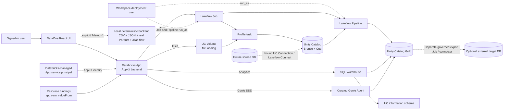

# Veltirs DataOne manager demo script and architecture guide

Use this guide for a 3–5 minute stakeholder walkthrough. The spoken script intentionally separates what the local demo simulates, what the current Databricks deployment implements, and what still belongs to a Marketplace-ready database migration edition.

Target workspace: `1354394467602787`. The hosted App is pending AWS connection and secret configuration.

Deployment evidence: target-workspace run `66144670168681` completed source profiling, the Lakeflow Spark Declarative Pipeline, project Gold publication, and SQL verification. The target workspace does not yet have the AWS MySQL/PostgreSQL Unity Catalog connections or copied secret values.

Latest target-workspace proof: the bundled CSV was uploaded to `workspace.dataone_bronze.dataone_landing` and launched run `66144670168681` with logical run ID `migration-20261001-01`. Profiling, the Pipeline, and project Gold publication completed `SUCCESS`. SQL independently verified 10 published rows, 16 checked rows, and one quality-summary row.

The verified project table is `workspace.dataone_gold.current_workspace_migration_demo`. The external PostgreSQL task correctly reported that publication is disabled for this target until its JDBC secrets are configured.

## 3–5 minute talk track

### 0:00–0:40 — The problem

“Data migration usually forces teams to jump between ingestion tools, schema spreadsheets, quality reports, job consoles, governance screens, and SQL editors. DataOne brings that journey into one governed Databricks application. A user can start with a CSV, JSON, or Parquet file—or an approved Unity Catalog table—and then follow the same run from profiling through mapping, cleaning, quality, visualization, and natural-language analysis.”

### 0:40–1:20 — The user journey

“The user signs in through Databricks, names the project, and chooses a source. For a file, DataOne validates CSV, JSON, or Parquet, uploads it to a bound Unity Catalog Volume, and starts one approved Lakeflow Job. For an existing table, the user enters a three-part Unity Catalog name; permissions still determine whether the app can read it. The UI then follows the Job as it profiles the source, invokes the quality Pipeline, and publishes passed records to a managed Delta table derived from the project name. When the run succeeds, all result screens open against the same run ID, so every number remains traceable.”

“The local demo also models a database journey using the aliases `demo-mysql-commerce` and `demo-postgres-analytics`. It stages the MySQL scenario through the same governed processing path, then shows PostgreSQL as a separate controlled export step. It never connects to either database, and the current workspace has no Unity Catalog `CONNECTION` objects. In production, an administrator must bind a Unity Catalog Connection or Lakeflow Connect resource; database passwords must not enter this UI. An external target remains a separately authorized export Job or connector—not a native sink in this DataOne Lakeflow Pipeline.”

### 1:20–2:20 — What the user sees

“The dashboard summarizes rows, quality, mapping coverage, quarantined records, and processing status. The Schema Mapper shows source and target names, types, confidence, and which fields need review; generated SQL is a review preview and is not silently published. Data Quality explains missing values, invalid email, date and numeric values, and the cleaning actions applied. Visualization places technical exceptions beside business outcomes such as revenue by category. Governance and Audit show the run identity, processing stages, governed assets, and recent activity.”

“The Prediction / Risk Forecast page combines three measured signals: 50% quality gap, 30% quarantine exposure, and 20% mapping-review exposure. The sample produces a 19-out-of-100 low-attention index. This and the mapping confidence are transparent deterministic heuristics—not probabilities or predictions from a trained model. A later predictive edition could bind a versioned Databricks Model Serving endpoint, but we must not label today’s rules as machine learning.”

“AskData is the natural-language entry point. Its question groups cover run health, data quality, schema mapping, business impact, prediction, and source-and-target architecture. In production it uses a dedicated, curated Genie Agent and displays generated SQL and results for verification. In local mode those answers and SQL previews are deterministic and are never executed.”

### 2:20–3:25 — Why Databricks is the backend

“The browser does not hold a workspace token or call arbitrary Databricks resource IDs. The React UI talks to its same-origin AppKit backend. Resource bindings resolve the approved Volume, Job, SQL warehouse, and Genie Agent. The Job coordinates execution, the Lakeflow Pipeline applies declarative quality logic, Unity Catalog stores and governs Bronze, operations, and Gold data, the SQL warehouse serves named analytics queries, and Genie provides governed NL2SQL.”

“Databricks authenticates the person using the app. After installation, AppKit Files, Analytics, Jobs API calls, and Genie run as the dedicated service principal created for that App. The Lakeflow Job and Pipeline have a separate `run_as` identity: the workspace user who deployed the bundle. OAuth is the production mechanism. A personal access token is acceptable only for an individual developer’s local tooling when OAuth is unavailable; it never belongs in React, source control, logs, screenshots, `app.yaml`, or a Marketplace package.”

### 3:25–4:20 — Marketplace path and close

“Today’s repository is a working Databricks application and a clearly labelled local sample demo. Before public Marketplace publication, we must remove workspace-specific IDs, define every dependency as an install-time or installer-provisioned resource, test installation, upgrades, rollback and uninstall in a clean workspace, and complete Databricks’ third-party app security review.”

“A customer then finds DataOne under Marketplace Apps, accepts the terms, moves into Databricks Apps, selects the required resources and scopes, installs it, and runs a readiness check. The app runs in that customer’s Databricks environment using their compute and governed data. The business value is one controlled path from source onboarding to trusted, explainable data—less manual handoff, faster issue discovery, and a clearer audit trail.”

## Architecture at a glance

### Resource-to-feature mapping

| DataOne action                                    | Databricks backend                                    | Where this repository uses it                                                                               |
| ------------------------------------------------- | ----------------------------------------------------- | ----------------------------------------------------------------------------------------------------------- |
| Upload CSV, JSON, or Parquet                      | AppKit Files plus bound UC Volume                     | `server/server.ts`, `server/dataoneValidation.ts`, and the `files` binding in `databricks.yml`              |
| Start and monitor a run                           | AppKit Jobs as app principal; Job `run_as` deployer   | `server/server.ts`, `client/src/pages/dataone/DataOneApp.tsx`, and `resources/dataone_orchestrator.job.yml` |
| Profile arbitrary source schemas                  | Serverless Spark Job task                             | `src/jobs/profile_source.py`                                                                                |
| Clean, classify, map, and summarize               | Lakeflow Spark Declarative Pipeline                   | `resources/dataone_quality.pipeline.yml` and `src/pipelines/dataone/transformations/quality_pipeline.py`    |
| Store files, metadata, run ledger, and results    | Unity Catalog Volume, tables, and materialized views  | `databricks.yml`, profiling code, and Pipeline code                                                         |
| Read KPIs, tables, charts, metadata, and topology | AppKit Analytics plus SQL warehouse                   | `config/queries/*.sql` and `useAnalyticsQuery(...)` in `DataOneApp.tsx`                                     |
| Ask natural-language questions                    | AppKit Genie plus a bound, curated Genie Agent        | `/api/askdata/default/messages`, `useGenieChat(...)`, and `config/genie/dataone-space.json`                 |
| Supply environment-specific identifiers           | Databricks App resource bindings                      | `app.yaml` uses `valueFrom`; the browser never receives the underlying credentials                          |
| Run the explicit local walkthrough                | Deterministic file parsers, fixture APIs, and aliases | `server/demoServer.ts`, `server/demoData.ts`, and `samples/customer_revenue_quality_demo.*`                 |

The normal runtime does not import the Databricks SDK or call REST endpoints directly. AppKit is the first choice for the implemented features. If a future capability is unavailable in AppKit, use an SDK or REST call only on the backend, authenticate with the app service principal, resolve IDs from bindings, validate all input, and apply an explicit authorization policy.

## Demo checklist

### Before the meeting

- Use the local UI at <http://localhost:8000> while the target hosted App is awaiting AWS connection and secret configuration. Use the Databricks run link when demonstrating verified target-workspace execution.
- From the project root, run `npm run demo`.
- Open `http://127.0.0.1:4173/?demo=1`.
- Confirm the UI says **Local demo** and **no Databricks calls**.
- Confirm these three bundled files are present: `samples/customer_revenue_quality_demo.csv`, `.json`, and `.parquet`.
- All three contain the equivalent 16 customer-order records. The Parquet file is a real Apache Parquet binary, not renamed text.
- Do not describe this local run as evidence that a workspace Job, Pipeline, warehouse, Unity Catalog asset, or Genie Agent executed.

### Click path and expected story

1. Select bundled **CSV**, then click **Run File Sample & Open Dashboard**. Explain that its 16 synthetic customer-order rows include missing values, malformed emails and dates, inconsistent country/status labels, and failed orders.
2. Pause on the progress screen to show the simulated `profile_source` and `quality_pipeline` stages.
3. On **Dashboard**, call out 16 rows, 11 columns, a 92.6% quality score, 13 issue cells, 34 transformed cells, 6 quarantined records, and 2 mappings requiring review.
4. Start a new run, select bundled **JSON**, and run it. Verify the same metrics.
5. Start another run, select bundled **Parquet**, and run it. State that the backend decodes an actual Parquet binary and verify the same metrics again.
6. Explain the parity result: all three files represent the same 16 records and normalize to one record contract, so matching KPIs demonstrate CSV, JSON, and Parquet parser parity—not three hardcoded screenshots.
7. Open **Schema Mapper**. Show source-to-target normalization, field types, confidence, review status, cleaned-record preview, and the generated SQL marked **not executed**.
8. Open **Data Quality**. Show column scores, the cleaning-action counts, and the six quarantined record previews with their issue and transformation totals.
9. Open **Data Visualization**. Point out the rule distribution—8 missing cells, 2 invalid dates, 2 invalid emails, and 1 invalid number—then connect it to the sample business story: $29,074 total order value and $12,994 on non-delivered orders. These are observed deterministic calculations, not a revenue forecast.
10. Open **Prediction / Risk Forecast**. Show the 19/100 low-attention scenario and its visible 50/30/20 formula. Say clearly: “This is an explainable heuristic, not a trained model, probability, or claim about a future outcome.”
11. Open **AskData**. Ask at least one question from each group:
    - **Run health:** latest quality score; rows cleaned or quarantined.
    - **Data quality:** weakest columns; detected issue types.
    - **Schema mapping:** mappings needing review; average confidence.
    - **Business impact:** highest-revenue category; run impact summary.
    - **Prediction:** heuristic risk index; largest contributing factor.
    - **Source & target:** current source and target; whether PostgreSQL is a native Pipeline sink.
12. State that these local answers and SQL previews are simulated and not executed. Production mode streams responses from the bound Genie Agent.
13. Start a new run and click **Use database demo**. Verify the UI shows only `demo-mysql-commerce` and `demo-postgres-analytics`; it must not request a hostname, password, PAT, or raw credential.
14. Click **Simulate Database Flow & Open Dashboard**. Narrate `demo-mysql-commerce` → governed Bronze/Ops staging → quality Pipeline → governed Gold → separate `publish_target` simulation for `demo-postgres-analytics`.
15. On the topology, Risk Forecast, and Audit pages, show that PostgreSQL is labelled as a controlled post-governance export boundary, not as a native Spark Declarative Pipeline sink and not as a real database connection.
16. Open **Audit Trail**. Close by connecting one run ID to its source alias, processing stages, execution identity, governed outputs, target-export state, and recent-run record.

If a number differs after uploading another supported file, explain that the local backend parses that file and recomputes deterministic analytics from its records. The bundled formats intentionally match; user-supplied data does not have to produce the same metrics. The live Databricks path has completed successful CSV, JSON, Parquet, and approved Unity Catalog table runs. The alias database path remains a local simulation because this workspace has no UC `CONNECTION` objects and no production connection/export resources are bound.

## Production and Marketplace boundaries

### Implemented production path

- Databricks SSO identifies the person opening the hosted app.
- AppKit resource operations use the service principal created for the App in the installation workspace.
- The Lakeflow Job and Pipeline execute as the workspace deployment user configured by `${workspace.current_user.userName}`.
- Resource bindings grant the app principal least-privilege access to one SQL warehouse, one landing Volume, one orchestrator Job, selected UC tables, and one Genie Agent. Job/Pipeline UC access is governed separately by the deployment user's grants.
- Files land in UC, the Job profiles them, the Job invokes the Pipeline, and named SQL queries read the governed results.
- The schema mapper is read-only. Persisting approvals and publishing a mapping contract require a separately authorized decision store and mutation path.

### Not implemented yet

- Live MySQL or PostgreSQL connectivity; the workspace has no Unity Catalog `CONNECTION` objects, so the displayed aliases are simulated.
- Installation-time creation or binding of a database-ingestion connection and managed ingestion flow.
- A direct external PostgreSQL target write.
- A trained prediction model or Model Serving endpoint.
- Native Unity Catalog system lineage in the topology screen; the current topology is derived from DataOne stages and run inventory.
- Complete per-user upload/run isolation, rate limits, retention, cleanup, and workspace-wide access controls.

### Safe source-database-to-target-database extension

1. At installation, an administrator creates or selects a Unity Catalog Connection or supported Lakeflow Connect resource and grants only the required privileges to the identity that will execute ingestion. In the current bundle, that workload identity is the workspace deployment user.
2. The UI selects a bound connection alias and governed source object; it never accepts or stores the underlying database password.
3. Lakeflow Connect or an approved ingestion Job lands the source in consumer-owned UC Bronze.
4. The existing profile and quality flow publishes trusted UC Gold outputs.
5. If the customer needs an external target database, a separate export Job or approved connector reads Gold and writes to that target using a secret/connection managed outside the browser. Its egress domains, write permissions, retries, idempotency, and audit records must be reviewed independently.

### Marketplace lifecycle

Provider preparation:

1. Use a Premium-or-higher Databricks account and a Unity Catalog-enabled provider workspace.
2. For a public listing, apply through the Databricks Data Partner Program; assign a Marketplace admin and create the provider profile. A private-exchange-only provider can follow the provider-console enrollment path.
3. Replace the current fixed workspace host, resource IDs, and existing service-principal dependency with a portable installation contract. Package or document every required Job, Pipeline, Volume/table, warehouse, Genie Agent, connection, compute choice, scope, and prerequisite.
4. Add idempotent install, upgrade, rollback, and uninstall behavior, plus accurate terms, privacy, support, data-flow, and egress documentation.
5. Test in a clean consumer-like workspace with the minimum permissions.
6. Coordinate the current app submission process with the Databricks partner team. A third-party app must complete Databricks’ comprehensive security review before publication; do not assume the development bundle alone is a publishable asset.

Consumer installation:

1. Find DataOne under Marketplace **Apps** and click **Install**.
2. Review and accept the provider terms, then continue to Databricks Apps.
3. Configure the required app resources and grant the requested scopes and resource permissions.
4. Review the app name, description, usage policy, and compute choice, then install.
5. Run a readiness test before granting broader `CAN USE` access. Install reviewed updates when Databricks Apps reports a new version.

Official references: [install third-party Marketplace apps](https://docs.databricks.com/aws/en/marketplace/get-started-consumer#get-access-to-third-party-apps), [become a Marketplace provider](https://docs.databricks.com/aws/en/marketplace/become-provider), [Databricks App resources](https://docs.databricks.com/aws/en/dev-tools/databricks-apps/resources), and [Databricks App authorization](https://docs.databricks.com/aws/en/dev-tools/databricks-apps/auth).
