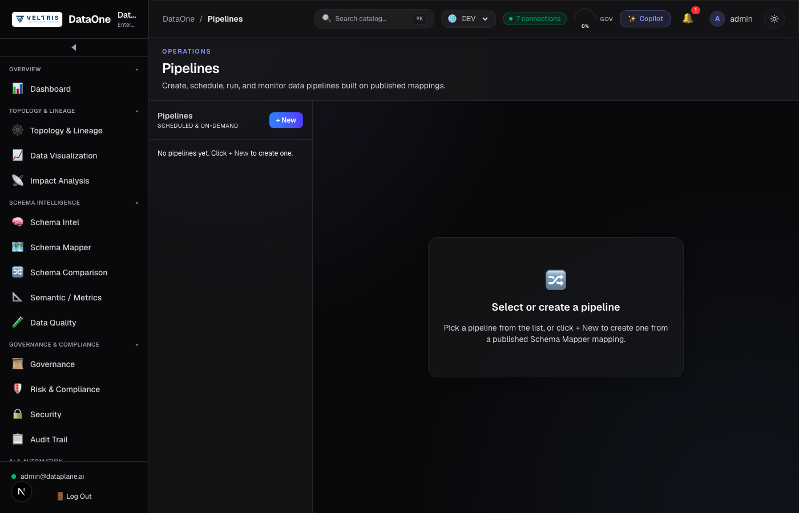
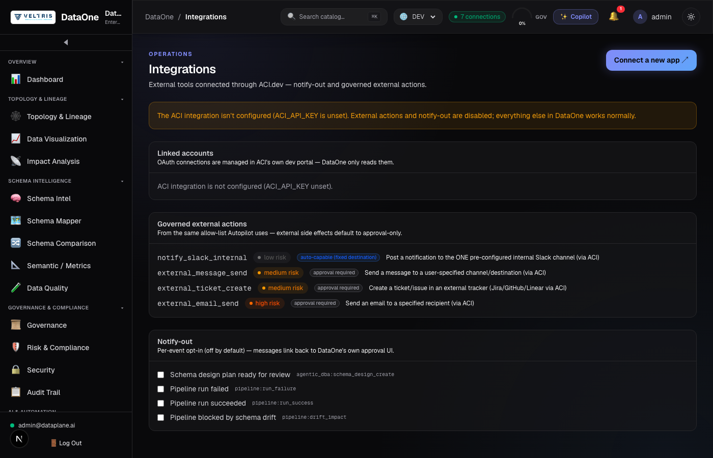
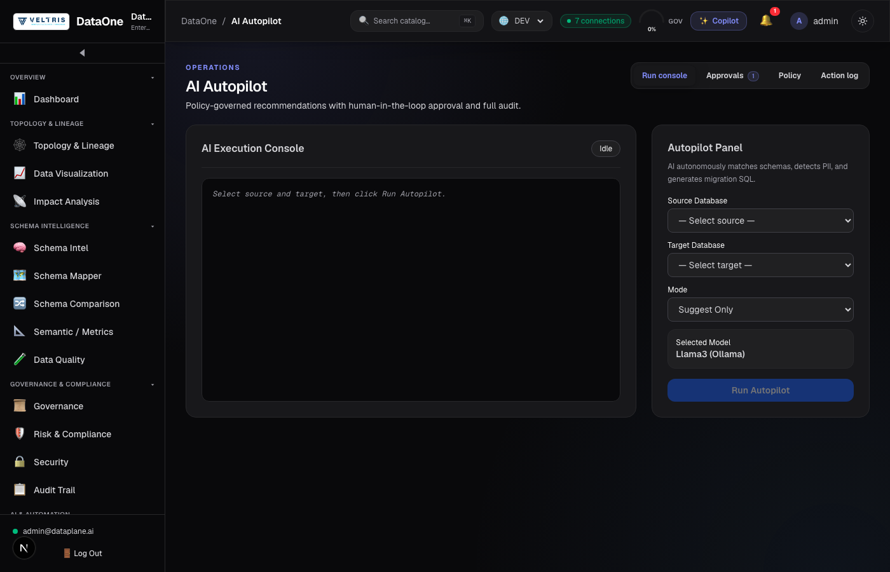

# Dashboard workspace design system — consistency pass

Screenshots taken 2026-07-22 after migrating `pipelines`, `integrations`, and
`autopilot` onto the shared `workspace-page` / `WorkspaceHeader` / `Badge` /
`SeverityChip` / `EmptyState` design system already used by the other 12
dashboard features (see `frontend/src/app/dashboard/components/`).

Captured with a headless Playwright run against the live dev stack
(`admin@dataplane.ai` login), no console errors on any of the three pages.

## Pipelines

## Integrations

## AI Autopilot

